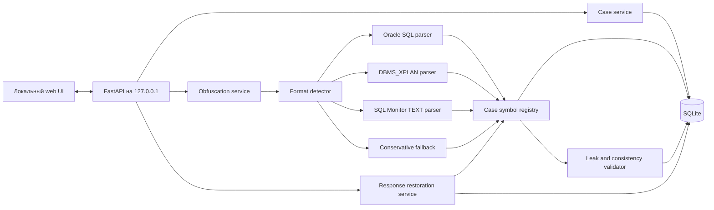

# Архитектура: Plan Obfuscator

Статус: реализовано и проверено  
Дата фиксации: 2026-10-09
Последнее обновление: 2026-10-10

Реализация находится в пакете `plan_obfuscator`. Windows-сборка создаётся в
`dist\PlanObfuscator.exe`. Архитектурные инварианты закреплены автоматическими
тестами в `tests`, а разбор реального Oracle проверяется скриптом
`scripts\oracle_smoke.py`.

## Цель и критерии успеха

Plan Obfuscator — локальное однопользовательское веб-приложение для обратимой
псевдонимизации диагностических материалов Oracle Database перед передачей их в
ChatGPT, Claude или другую языковую модель.

Приложение принимает:

- текст одного логического SQL-запроса;
- вывод `DBMS_XPLAN`;
- отчёты SQL Monitor в формате `TEXT`;
- отдельно переданные `Outline Data`;
- отдельно переданные predicates.

Оно должно согласованно заменить чувствительные значения во всех материалах
кейса, сформировать единый текст для ручного копирования, сохранить историю,
принять вставленный пользователем ответ ИИ и восстановить в нём исходные имена и
значения.

Первая версия считается успешной, если выполняются следующие условия:

1. Одна сущность получает один и тот же маркер во всех материалах одного кейса.
2. Разные кейсы не разделяют mapping и получают независимые маркеры.
3. Собственный обфусцированный артефакт приложения можно точно восстановить по
   сохранённому манифесту замен.
4. Маркеры в ответе ИИ восстанавливаются через mapping кейса; неизвестные или
   повреждённые маркеры не заменяются молча.
5. Cost, cardinality, rows, bytes, elapsed time, CPU, I/O, memory и другие
   показатели производительности не меняются.
6. После перезапуска приложения можно открыть старый кейс и восстановить ранее
   полученный ответ.
7. Приложение не обращается к внешним сервисам и не отправляет данные в сеть.
8. История хранит исходные материалы, обфусцированные prompt-пакеты, сырые ответы
   ИИ и восстановленные ответы.

## Ограничения и допущения

- Целевая ОС первой версии — Windows.
- Целевая СУБД — Oracle Database 19c.
- Поддерживаемый формат SQL Monitor — только `TEXT`.
- `HTML`, `ACTIVE` и `XML` отчёты SQL Monitor в первую версию не входят.
- Приложение работает локально и слушает только `127.0.0.1`.
- Контур считается доверенным; аутентификация пользователя не требуется.
- Данные хранятся в обычном SQLite без прикладного шифрования и без SQLCipher.
- Один кейс соответствует одному логическому SQL-запросу.
- В кейсе допускается несколько планов, child cursors, plan hash и запусков SQL
  Monitor для этого запроса.
- Обмен с ChatGPT и Claude выполняется вручную через copy/paste. Интеграции с API
  моделей отсутствуют.
- Mapping строится полностью автоматически. Редактора mapping нет.
- Обфусцированный SQL предназначен для анализа языковой моделью, а не для
  выполнения в Oracle.
- Заголовки секций Oracle в первой версии предполагаются англоязычными.
- Метрики могут косвенно раскрывать объёмы данных и характер нагрузки. Этот риск
  принят, поскольку сохранение диагностической ценности важнее их маскирования.
- Файл SQLite и его резервные копии защищаются средствами локального контура.

## Термины

- **Кейс** — история анализа одного логического SQL-запроса.
- **Артефакт** — SQL, `DBMS_XPLAN`, SQL Monitor `TEXT`, outline или predicates.
- **Ревизия** — неизменяемая версия артефакта.
- **Символ** — логическая сущность, которой назначен обратимый маркер.
- **Mapping** — соответствие между символом, маркером и предпочтительным
  представлением оригинала.
- **Occurrence** — конкретное вхождение символа в исходном тексте с координатами
  и точным исходным написанием.
- **Run** — зафиксированный запуск обфускации над выбранными ревизиями.
- **Prompt-пакет** — объединённый обфусцированный текст для передачи ИИ.
- **Response** — сырой обфусцированный и восстановленный ответы ИИ.

## Выбранное решение

### Технологический стек

- Python — основной язык приложения.
- FastAPI — локальный HTTP backend.
- Jinja2 и небольшой объём vanilla JavaScript — пользовательский интерфейс без
  отдельной SPA.
- SQLAlchemy 2 — доступ к SQLite.
- Alembic — версионирование схемы БД.
- SQLGlot с Oracle dialect — AST и лексический разбор SQL там, где диалект
  поддерживается.
- Собственные секционные парсеры — для `DBMS_XPLAN`, SQL Monitor `TEXT`, outline
  и predicates.
- SQLite в режиме WAL — локальная история и mapping.

Файл БД по умолчанию располагается в:

`%LOCALAPPDATA%\PlanObfuscator\plan_obfuscator.db`

Статические ресурсы поставляются вместе с приложением. CDN, внешние шрифты,
телеметрия и сетевые аналитические сервисы не используются.

### Компоненты

### Пользовательский поток

1. Пользователь создаёт кейс и задаёт ему название.
2. В кейс добавляются один SQL и любое число связанных диагностических
   артефактов.
3. Тип артефакта определяется автоматически по структуре и заголовкам.
4. Из SQL Monitor и `DBMS_XPLAN` автоматически извлекаются вложенный SQL,
   outline, predicates и другие поддерживаемые секции.
5. Приложение проверяет, что обнаруженный SQL относится к текущему кейсу.
6. Парсеры создают типизированные occurrences, после чего registry находит или
   создаёт символы и назначает им маркеры.
7. Замены применяются к исходным диапазонам символов. SQL не генерируется заново,
   поэтому исходное форматирование не меняется без необходимости.
8. Валидатор проверяет согласованность mapping, сохранность метрик и возможные
   необработанные чувствительные фрагменты.
9. Приложение сохраняет run и формирует prompt-пакет для копирования.
10. Пользователь вставляет ответ ИИ, приложение сохраняет сырой ответ,
    восстанавливает известные маркеры и сохраняет восстановленный вариант.

### Граница кейса

Один кейс содержит ровно один логический SQL, но может включать:

- несколько ревизий его текста;
- несколько `DBMS_XPLAN`;
- разные child cursors;
- разные планы и plan hash;
- несколько SQL Monitor отчётов для разных выполнений;
- несколько prompt-пакетов;
- несколько ответов ИИ.

Нормализованный AST используется для проверки принадлежности SQL текущему
кейсу. Для усечённого SQL из SQL Monitor допускается безопасное сопоставление по
префиксу и доступным метаданным. Если обнаружен другой независимый SQL,
артефакт не присоединяется к кейсу; интерфейс предлагает создать отдельный кейс.

### Стратегия разбора

#### SQL

1. Oracle lexer определяет токены и их координаты.
2. SQLGlot AST используется для классификации схем, таблиц, колонок, aliases,
   literals и других выражений.
3. Oracle hints и outline-like comments разбираются отдельным tokenizer, потому
   что поддержка всех optimizer hints обычным SQL AST не гарантируется.
4. AST применяется только для понимания структуры. Итоговый текст строится
   заменой исходных диапазонов, а не повторной генерацией SQL.

#### DBMS_XPLAN

Парсер распознаёт как минимум следующие части:

- SQL header и SQL text;
- основную plan table и колонку `Name`;
- `Query Block Name / Object Alias`;
- `Outline Data`;
- `Predicate Information`;
- `Column Projection Information`;
- `Peeked Binds`;
- `Remote SQL Information`;
- `Note` и диагностические предупреждения.

Ширина строк, набор колонок и переносы не считаются фиксированными. Табличные
колонки определяются по разделителям и заголовку конкретного отчёта.

#### SQL Monitor TEXT

Парсер распознаёт:

- `SQL Text`;
- `Global Information`;
- `Global Stats`;
- `SQL Plan Monitoring Details`;
- идентификаторы выполнения и сессии;
- module, action, service, program и hostname;
- object names в плане;
- binds и дополнительные секции, если они присутствуют.

Названия и значения performance metrics сохраняются. Идентифицирующие значения
в тех же таблицах маскируются по типу поля.

#### Conservative fallback

Полностью автоматический режим использует трёхступенчатую стратегию:

1. Структурный разбор известного формата.
2. Oracle-aware лексический разбор, если структурный parser не справился.
3. Замена всего неизвестного чувствительного фрагмента одним маркером, если его
   невозможно безопасно классифицировать.

Неизвестный фрагмент нельзя оставлять в prompt молча. Цена такого решения —
возможная потеря части диагностической информации вместо риска утечки.

### Классификация данных

Маскируются:

- schema, table, view, materialized view и synonym names;
- column, index, constraint, partition и subpartition names;
- aliases и query block names;
- database links;
- usernames, database names, services, hosts, programs, modules и actions;
- SQL ID, plan hash, full plan hash, execution ID, object ID, SID и serial;
- bind names и captured bind values;
- строковые, числовые, date/time, interval и binary literals в SQL;
- пользовательские комментарии и неизвестный свободный текст;
- иные значения, классифицированные как идентификаторы.

Сохраняются:

- Oracle SQL keywords;
- названия plan operations;
- имена известных Oracle hints, функций и типов данных;
- известные Oracle wait events;
- plan line ID и структурные связи операций;
- cost, estimated и actual rows;
- bytes, elapsed time, CPU time, I/O, memory, temp и executions;
- timestamps, как было согласовано;
- форматирование, разделители и структурные заголовки отчёта.

### Mapping и маркеры

Mapping имеет область видимости одного кейса. Ключ символа включает тип сущности
и её Oracle-aware canonical value. Неquoted Oracle identifier нормализуется с
учётом обычной регистронезависимой семантики Oracle; quoted identifier остаётся
регистрозависимым.

Формат маркера:

`OBF_<case-prefix>_<type>_<number>_<check>`

Пример: `OBF_K3F_TBL_0001_X7`.

Свойства схемы маркеров:

- короткий случайный prefix различает кейсы;
- type делает текст понятнее для ИИ;
- number стабилен и никогда не переиспользуется в кейсе;
- check помогает обнаруживать повреждённые маркеры;
- маркеры не являются секретом и не содержат исходного значения;
- новый символ всегда получает новый номер;
- удаление артефакта не удаляет и не переназначает ранее использованный маркер.

Для identifiers и строковых literals по возможности сохраняются окружающие
кавычки. Числовой literal может быть заменён неприводимым маркером, поскольку
обфусцированный SQL не предназначен для исполнения.

### Два режима обратного преобразования

1. **Точное восстановление артефакта.** Для каждого occurrence сохраняются
   координаты, маркер и точный исходный lexeme. Это позволяет побайтово
   восстановить собственный неизменённый обфусцированный текст приложения.
2. **Восстановление ответа ИИ.** Маркеры заменяются на предпочтительное
   представление оригинала из mapping. Побайтовое совпадение здесь неприменимо,
   потому что ответ создан моделью и может изменить регистр, кавычки и контекст.

При восстановлении ответа допускается регистронезависимое точное распознавание
целого маркера. Fuzzy matching не используется: неизвестный или повреждённый
маркер остаётся в тексте и попадает в предупреждения.

### Формат prompt-пакета

Prompt-пакет содержит короткую служебную инструкцию не изменять `OBF_*` маркеры,
после чего располагает артефакты в явно разделённых секциях:

- SQL;
- DBMS_XPLAN с порядковым номером;
- SQL Monitor TEXT с порядковым номером;
- standalone outline;
- standalone predicates;
- пользовательский вопрос к модели.

Mapping и оригинальные значения в prompt-пакет никогда не включаются.

### Проверки перед выдачей prompt

Валидатор выполняет следующие проверки:

- все occurrences имеют существующий symbol;
- все выданные маркеры принадлежат текущему кейсу;
- исходные значения известных symbols не остались в обфусцированном тексте;
- значения performance metrics не изменились;
- секции отчёта не потерялись и сохранили порядок;
- прямое обратное преобразование run восстанавливает исходные ревизии;
- неизвестные строки, quoted identifiers и свободный текст обработаны fallback;
- parser warnings сохранены и показаны пользователю.

Mapping не редактируется вручную. Интерфейс может показывать только read-only
статистику и предупреждения для диагностики.

## Модель данных

### `cases`

- UUID кейса;
- title и optional description;
- Oracle version, по умолчанию `19c`;
- case marker prefix;
- canonical SQL fingerprint;
- даты создания и изменения;
- состояние кейса.

### `artifacts`

- UUID артефакта;
- ссылка на кейс;
- автоматически определённый тип;
- пользовательское отображаемое имя;
- ссылка на текущую ревизию.

### `artifact_revisions`

- UUID ревизии;
- ссылка на артефакт;
- номер версии;
- исходный текст;
- дата создания;
- результат определения формата.

Ревизии неизменяемы. Редактирование создаёт новую ревизию.

### `symbols`

- UUID символа;
- ссылка на кейс;
- entity type;
- canonical value;
- предпочтительное исходное представление;
- marker;
- порядковый номер;
- provenance и confidence;
- даты создания и последнего использования.

В пределах кейса уникальны пары `(entity_type, canonical_value)` и marker.

### `obfuscation_runs`

- UUID run;
- ссылка на кейс;
- дата запуска;
- parser version;
- token scheme version;
- snapshot настроек;
- готовый prompt-пакет;
- validation status.

### `run_artifacts`

- ссылка на run;
- ссылка на конкретную artifact revision;
- обфусцированный текст;
- порядок в prompt-пакете.

### `replacement_occurrences`

- ссылка на run artifact;
- ссылка на symbol;
- координаты в исходном и обфусцированном тексте;
- точный original lexeme;
- использованный marker и контекст quoting.

### `responses`

- UUID ответа;
- ссылка на run;
- optional model label;
- сырой ответ ИИ;
- восстановленный ответ;
- список неизвестных маркеров;
- дата создания.

### `findings`

- ссылка на run или response;
- severity;
- parser/validator code;
- artifact и диапазон, если применимо;
- человекочитаемое сообщение;
- технические детали без дублирования полного исходного текста в логах.

SQLite использует foreign keys, короткие транзакции и WAL. Миграции схемы
выполняются через Alembic. Mapping и старые token scheme version сохраняются для
обратной совместимости истории.

## Интерфейс

Основной экран строится как двухпанельный chat workspace, а не как набор
технических форм.

### Левая панель кейсов

- фиксированная панель шириной около 280 px;
- создание кейса одной кнопкой без модального окна;
- новый кейс получает временное название `Новый кейс`;
- после первого вопроса название автоматически формируется из первых 60 символов;
- поиск по названию;
- сортировка по времени изменения;
- статус последнего действия: материалы добавлены, prompt готов, ответ
  восстановлен или есть warning;
- количество активных материалов и краткое время изменения;
- меню `…` для переименования и удаления;
- на узком экране панель превращается в выдвижной drawer.

### Правая область

Правую часть образуют компактный header кейса, прокручиваемая лента и
закреплённый снизу composer.

Header содержит title, Oracle version, статус контекста, переключатель
`Последний цикл / Вся история` и меню кейса. Значение по умолчанию — последний
цикл; настройка сохраняется локально как UI preference и не содержит
чувствительных данных.

### Лента

Лента имеет семантику последовательного chat log. Она состоит из типизированных
карточек:

- **Контекст** — всегда первая карточка: SQL, XPLAN, SQL Monitor, outline и
  predicates в виде badges; полный текст по умолчанию скрыт;
- **Вопрос пользователя**;
- **Prompt** — validation status, findings, свёрнутый prompt и основная кнопка
  копирования;
- **Восстановленный ответ** — основной открытый результат;
- **Сырой ответ** — вложенное раскрытие `Показать оригинал`;
- **Системное событие** — распознавание материала, warning или ошибка;
- **Изменение контекста** — отметка о новой ревизии или новом материале.

В режиме `Последний цикл` показывается актуальный контекст, последний run и все
его responses. В режиме `Вся история` runs и responses выводятся хронологически.
Длинный SQL или отчёт не раскрывается автоматически и не занимает высоту ленты.
Лента использует доступную семантику `role=log`; отдельные события представлены
как articles.

### Универсальный composer

В интерфейсе существует одно поле ввода. Оно принимает текст, paste и файлы
`.sql`, `.txt`, `.log`. `Enter` добавляет строку, `Ctrl+Enter` отправляет.

Классификация выполняется в следующем порядке:

1. Oracle SQL, DBMS_XPLAN, SQL Monitor TEXT, outline или predicates добавляются
   как material текущего контекста.
2. Текст с известными `OBF_*` markers последнего run обрабатывается как ответ ИИ.
3. Обычный текст считается вопросом и сразу создаёт новый run и prompt.
4. При низкой уверенности интерфейс показывает inline-выбор
   `Материал / Вопрос / Ответ ИИ`, не открывая отдельную форму.

После копирования prompt placeholder меняется на предложение вставить ответ
ChatGPT или Claude, но automatic classification остаётся активной. Если вопрос
отправлен без материалов, run не создаётся: вопрос остаётся в composer, а в
ленте появляется понятное требование добавить материал.

Если после run добавлен или изменён material, context получает статус `Изменён`.
Предыдущие prompt и responses остаются неизменными; новый run создаётся только
после следующего вопроса. Другой логический SQL не присоединяется к кейсу —
системная карточка предлагает создать отдельный кейс.

Редактирование, revisions и удаление материалов находятся внутри раскрываемой
карточки `Контекст`. Ручного редактора mapping нет.

## Ключевые решения и их обоснование

| Решение | Рассмотренные альтернативы | Обоснование |
|---|---|---|
| Обычный SQLite | SQLCipher, прикладное AES-шифрование, PostgreSQL | Приложение работает в доверенном локальном контуре; SQLite достаточно для одного пользователя и не требует отдельного сервера. |
| Один SQL на кейс | Несколько независимых SQL в общем mapping | Устраняет неоднозначность aliases, query blocks и одинаковых колонок; несколько выполнений того же SQL остаются поддержанными. |
| FastAPI + server-rendered UI | React SPA, Electron, browser-only | Меньше сборочной сложности, прямой доступ к Python parser ecosystem и полноценная локальная история. |
| Hybrid chat workspace | Технические формы, буквальные chat bubbles | Лента соответствует основному workflow, а типизированные сворачиваемые карточки не превращают большие планы в бесконечную простыню. |
| Один universal composer | Отдельные формы для material, question и response | Уменьшает число действий; ambiguity обрабатывается confidence и inline override. |
| Гибрид AST + section parsers + fallback | Только regex, полная перегенерация AST | Regex пропускает контекст, а перегенерация меняет Oracle SQL. Гибрид сохраняет исходный текст и понимает структуру. |
| Автоматический mapping | Ручной редактор | Пользователь выбрал полностью автоматический процесс; неоднозначности решаются консервативным fallback. |
| Copy/paste | API ChatGPT/Claude | Исключает сетевую интеграцию и управление внешними credentials. |
| SQL Monitor TEXT | HTML, ACTIVE, XML | TEXT проще безопасно разбирать и непосредственно пригоден для LLM. |
| Mapping только внутри кейса | Глобальный dictionary | Исключает нежелательную корреляцию объектов между независимыми анализами. |
| Точное восстановление только известных маркеров | Fuzzy matching | Fuzzy matching способен подставить секрет в неправильное место. |

## Отклонённые альтернативы и причины

### Только регулярные выражения

Не различают identifiers, keywords, literals и метрики во всех Oracle-контекстах;
не обеспечивают надёжную обработку quoted identifiers, hints, predicates и
outline.

### Полная генерация SQL из AST

SQLGlot сохраняет смысл выражения, но может изменить форматирование, регистр,
кавычки и отдельные диалектные конструкции. Для диагностических материалов
нужна замена по исходным диапазонам.

### Несколько независимых SQL в одном кейсе

Усложняют разрешение aliases и одинаковых имён, привязку планов и объяснение
mapping пользователю. Связанные SQL оформляются отдельными кейсами.

### Глобальный mapping между кейсами

Упрощает сравнение, но делает независимые выгрузки коррелируемыми и создаёт
долгоживущий dictionary всех объектов.

### Редактор mapping

Повышает точность крайних случаев, но нарушает выбранный полностью автоматический
workflow и усложняет интерфейс. Вместо него применяется fail-safe fallback.

### Шифрование локальной БД

Не требуется в согласованной модели угроз. Файл SQLite хранится внутри
защищённого контура в открытом виде.

## Риски и открытые вопросы

### Принятые риски

- Plan shape и неизменённые метрики могут раскрывать объёмы и характер нагрузки.
- Обычный SQLite доступен любому субъекту с доступом к пользовательскому профилю
  и резервным копиям.
- Полностью автоматический fallback может скрыть больше данных, чем необходимо,
  и снизить качество ответа ИИ.
- Языковая модель может изменить маркер. Такой маркер останется невосстановленным
  и будет показан в findings.

### Технические риски

- SQLGlot может не разобрать редкую Oracle 19c конструкцию. Обязателен лексический
  fallback и набор regression fixtures.
- SQL Monitor `TEXT` зависит от `report_level`, SQL*Plus settings, ширины строки,
  RAC/parallel execution и наличия binds.
- `DBMS_XPLAN` имеет разные наборы секций в зависимости от format options.
- Свободные comments и `Note` не имеют строгой грамматики; неизвестный текст
  должен маскироваться консервативно.
- Локально доступен Oracle XE 21.3, а не 19c. Он подходит только для smoke-тестов;
  эталонные fixtures должны опираться на Oracle 19c.

Блокирующих открытых продуктовых вопросов для первой версии нет.

## Стратегия тестирования

### Корпус

- официальные примеры Oracle 19c SQL Monitor `TEXT`;
- официальные примеры Oracle 19c `DBMS_XPLAN` с aliases, outline и predicates;
- синтетические Oracle 19c запросы с quoted identifiers, hints, binds, literals,
  subqueries, CTE, partitioning и database links;
- реальные отчёты из локального Oracle XE 21.3 как дополнительные smoke-tests;
- варианты переноса строк, `report_level` и набора plan columns.

### Автоматические проверки

- golden tests для каждого parser;
- exact round-trip собственных артефактов;
- согласованность symbol mapping между SQL, XPLAN и SQL Monitor;
- неизменность performance metrics;
- сохранение истории после перезапуска;
- обратная совместимость token scheme и parser versions;
- обнаружение неизвестных и повреждённых маркеров;
- отсутствие внешних HTTP-запросов;
- интеграционные проверки UI основных пользовательских сценариев.

## План реализации

1. Создать каркас FastAPI, server-rendered UI, локальный launcher и структуру
   пакетов.
2. Ввести SQLAlchemy models, Alembic migrations и lifecycle SQLite.
3. Реализовать кейсы, артефакты, неизменяемые ревизии и историю.
4. Реализовать symbol registry, token scheme, occurrences и точный reverse.
5. Реализовать Oracle SQL lexer/AST pipeline и parser hints.
6. Реализовать секционный parser `DBMS_XPLAN`.
7. Реализовать parser SQL Monitor `TEXT`.
8. Реализовать conservative fallback и validation pipeline.
9. Реализовать prompt-пакеты, copy workflow и хранение runs.
10. Реализовать приём, восстановление и историю ответов ИИ.
11. Добавить corpus Oracle 19c, golden tests и smoke-tests Oracle XE 21.3.
12. Собрать Windows launcher/package и проверить работу без внешней сети.
